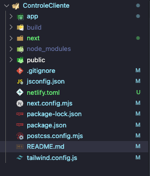
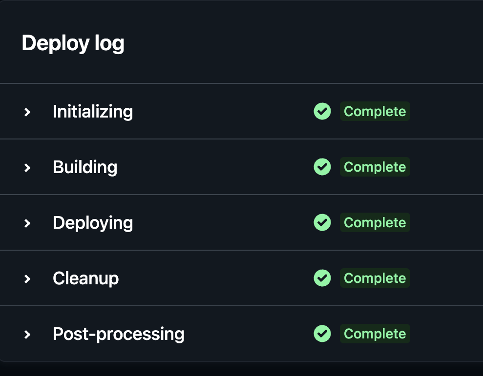

This is a [Next.js](https://nextjs.org/) project bootstrapped with [`create-next-app`](https://github.com/vercel/next.js/tree/canary/packages/create-next-app).

# **Fazendo deploy no GITHUB**

cosme Teixeira da Silva

1. Criar um Repositório dentro do seu GitHUB
2. Subir os arquivos necessários como a imagem abaixo

   

3) Abra seu Netlify e importe via Git HUB

Finalilzando deve ver a imagem como abaixo e assim está online seu Aplicativo ou LandPage para o Mundo:

