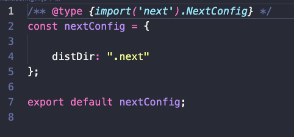
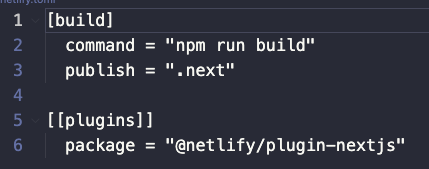

# **Fazendo deploy na Netlify**

Por cosme Teixeira Silva

verifique se o arquivo next.config.mjs está como o abaixo:

OBS: Instale a biblioteca abaixo

npm install -D @netlify/plugin-nextjs

Crie e edite como abaixo o arquivo netlify.toml na pasta raiz do projeto

1. Criar um Repositório dentro do seu GitHUB
2. Subir os arquivos necessários como a imagem abaixo

   

3) Abra seu Netlify e importe via Git HUB

Finalilzando deve ver a imagem como abaixo e assim está online seu Aplicativo ou LandPage para o Mundo:

